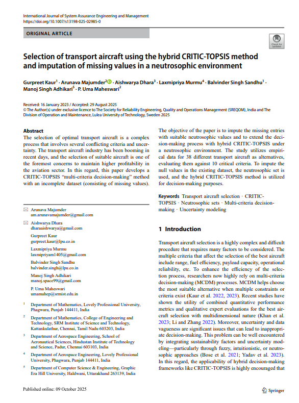

# Selection of Transport Aircraft Using Hybrid CRITIC-TOPSIS and Neutrosophic Decision-Making

## Overview

This repository contains the research work associated with the Springer-published paper:

**Selection of Transport Aircraft Using the Hybrid CRITIC-TOPSIS Method and Imputation of Missing Values in a Neutrosophic Environment**

The study presents a hybrid Multi-Criteria Decision-Making (MCDM) framework for evaluating and selecting transport aircraft under uncertain and incomplete data conditions.

---

## Publication

### Journal

**International Journal of System Assurance Engineering and Management (Springer)**

### Publication Year

**2025**

### Authors

- Gurpreet Kaur
- Arunava Majumder
- Aishwarya Dhara
- Laxmipriya Murmu
- Balvinder Singh Sandhu
- Manoj Singh Adhikari
- P. Uma Maheswari

---

## Research Objective

Transport aircraft selection is a complex engineering decision involving multiple performance parameters and incomplete information.

This research integrates:

- Neutrosophic Sets
- CRITIC Weighting Method
- TOPSIS Ranking Method

to improve decision accuracy and robustness in aircraft evaluation and selection.

---

## Methodology

1. Data Collection
2. Missing Value Imputation
3. Neutrosophic Representation of Data
4. CRITIC Weight Calculation
5. TOPSIS Ranking
6. Aircraft Selection and Evaluation

---

## Dataset Characteristics

- 38 Transport Aircraft Alternatives
- 10 Evaluation Criteria
- Incomplete and Uncertain Data Environment

### Example Evaluation Parameters

- Maximum Take-Off Weight (MTOW)
- Static Thrust
- Aspect Ratio
- Wing Loading
- Fineness Ratio
- Range
- Cruise Speed
- Take-Off Distance
- Thrust-to-Weight Ratio
- Fuel Consumption

---

## Research Contributions

- Development of a Hybrid CRITIC-TOPSIS Framework
- Missing Value Handling through Neutrosophic Representation
- Multi-Criteria Transport Aircraft Evaluation
- Improved Decision Support Methodology
- Application of MCDM Techniques in Aerospace Engineering

---

## Repository Structure

```text
Transport-Aircraft-Selection-CRITIC-TOPSIS
│
├── README.md
│
├── paper
│   └── publication.pdf
│
└── images
    └── publication-first-page.png
```

---

## Publication Files

### Research Paper

The complete Springer publication is available in:

```text
paper/publication.pdf
```

### First Page Preview



---

## Internship Association

This research was conducted during an internship at **Innova World** and was subsequently published in a Springer-indexed journal.

---

## Skills Demonstrated

- Aerospace Systems Analysis
- Multi-Criteria Decision Making (MCDM)
- CRITIC Method
- TOPSIS
- Neutrosophic Sets
- Research Methodology
- Technical Writing
- Data Analysis
- Aircraft Performance Evaluation

---

## Author

**Laxmipriya Murmu**

B.Tech Aerospace Engineering  
Lovely Professional University

### Research Interests

- Aerospace Systems Engineering
- Aircraft Performance Analysis
- Space Systems
- Decision Analytics
- Engineering Optimization

### Connect

[LinkedIn](https://www.linkedin.com/in/laxmipriyamurmu/)

[GitHub](https://github.com/laxmipriyamurmu)
